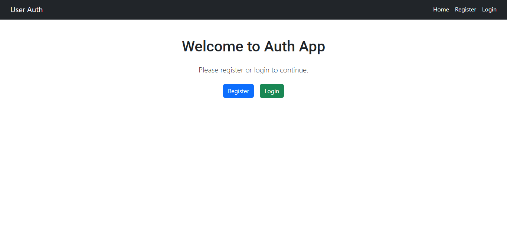

# 🔐 Password Reset Flow - Frontend (React)

This is the frontend of the **Password Reset Flow** project built using **React**, **Bootstrap**, **Axios**, and **React Router**. It connects with a Node.js + MongoDB backend to handle user registration, login, password reset, and logout functionality.

---

## 🚀 Features

- 🔐 User Registration & Login with JWT
- 🧠 Forgot Password flow with reset link
- 🔑 JWT Authentication (with Local Storage)
- 📝 Reset password via token
- 🚪 Logout feature (removes JWT and redirects user)
- 📤 Toast notifications using `react-toastify`
- 🎨 Clean and responsive UI using Bootstrap

---

## 🧪 Tech Stack used

- ⚛ **React JS** - Frontend library for building UI
- ⚡ **Vite** - Fast build tool and development server
- 🧭 **React Router DOM** - Routing and navigation between pages
- 💅 **Bootstrap 5** - For responsive layout and styling
- 🔔 **React-Toastify** - For showing alert messages (toast notifications)
- 📡 **Axios** - For handling API requests to the backend
- 🧠 **JWT(JSON Web Token)** - Used for secure authentication (stored in localStorage)

---

## 🧭 Frontend Routes(React Router)

| Path              | Description                      |
| ----------------- | -------------------------------- |
| `/`               | Home Page                        |
| `/register`       | Register New User                |
| `/login`          | Login Existing User              |
| `/forgot-password` | Form to Request Reset Email      |
| `/reset-password`  | Reset Form With Token from Email |

---

## 🔗 Backend API Endpoints

| Method | Route                | Description         |
| ------ | -------------------- | ------------------- |
| POST   | /api/register        | Register new user   |
| POST   | /api/login           | Login and get token |
| POST   | /api/forgot-password | Send reset link     |
| POST   | /api/reset-password  | Reset password      |

---

## 📸 Screenshot

